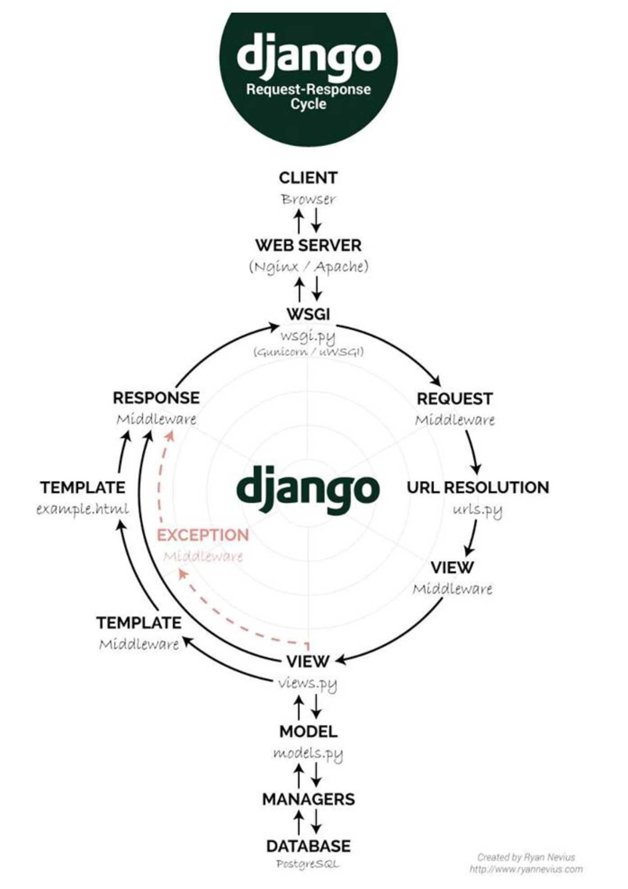

# 20팀 Cheers(임수경, 변규탁)

## 작업기간
2022-11-16 ~ 2022-11-21

## 배포 페이지
http://kdt.pythonanywhere.com/

## 기술 스택
<p dir="auto"><a href="https://camo.githubusercontent.com/49eb9c9af9ea6b38df033c1e0a60b03bb83b31da5681b19c92a8c323d5f2862e/68747470733a2f2f696d672e736869656c64732e696f2f62616467652f48544d4c352d4533344632363f7374796c653d666c61742d737175617265266c6f676f3d48544d4c35266c6f676f436f6c6f723d666666666666" rel="nofollow">
</a>
<a href="https://camo.githubusercontent.com/0a61ab105aba1995e5ee5dd7d8589bdce693083220f95f66643c341721493afa/68747470733a2f2f696d672e736869656c64732e696f2f62616467652f435353332d3135373242363f7374796c653d666c61742d737175617265266c6f676f3d43535333266c6f676f436f6c6f723d666666666666" rel="nofollow">
</a>
<a href="https://camo.githubusercontent.com/e07b7f45920ae5686797c3a6a60a46055558f29f7195eb1ccd6fef670094ab22/68747470733a2f2f696d672e736869656c64732e696f2f62616467652f507974686f6e2d3337373641423f7374796c653d666c61742d737175617265266c6f676f3d507974686f6e266c6f676f436f6c6f723d666666666666" rel="nofollow"></a>
<a href="https://camo.githubusercontent.com/58b2d37bba12ab15c1dcf0a4d9e78740129663fd893809953a26e01d4b0e48f6/68747470733a2f2f696d672e736869656c64732e696f2f62616467652f446a616e676f2d3039324532303f7374796c653d666c61742d737175617265266c6f676f3d446a616e676f266c6f676f436f6c6f723d666666666666" rel="nofollow"></a>
<a href="https://camo.githubusercontent.com/dd6fd40b8ef4f3835a3359f8375eaa2cbfa94996825d6788a107086f79ce719f/68747470733a2f2f696d672e736869656c64732e696f2f62616467652f4769742d4630353033323f7374796c653d666c61742d737175617265266c6f676f3d476974266c6f676f436f6c6f723d666666666666" rel="nofollow"></a>
<a href="https://camo.githubusercontent.com/2317e6f404424fb07fbdf73d59c9f5e91b38562168bebdf2d035fdbc605621a5/68747470733a2f2f696d672e736869656c64732e696f2f62616467652f4769744875622d3138313731373f7374796c653d666c61742d737175617265266c6f676f3d476974487562266c6f676f436f6c6f723d666666666666" rel="nofollow"></a></p>


# 작업한 부분


# 배운 내용
## Allauth accounts url 
```python
urlpatterns = [

    path("signup/", views.signup, name="account_signup"),

    path("login/", views.login, name="account_login"),

    path("logout/", views.logout, name="account_logout"),

    path(

        "password/change/",

        views.password_change,

        name="account_change_password",

    ),

    path("password/set/", views.password_set, name="account_set_password"),

    path("inactive/", views.account_inactive, name="account_inactive"),

    # E-mail

    path("email/", views.email, name="account_email"),

    path(

        "confirm-email/",

        views.email_verification_sent,

        name="account_email_verification_sent",

    ),

    re_path(

        r"^confirm-email/(?P<key>[-:\w]+)/$",

        views.confirm_email,

        name="account_confirm_email",

    ),

    # password reset

    path("password/reset/", views.password_reset, name="account_reset_password"),

    path(

        "password/reset/done/",

        views.password_reset_done,

        name="account_reset_password_done",

    ),

    re_path(

        r"^password/reset/key/(?P<uidb36>[0-9A-Za-z]+)-(?P<key>.+)/$",

        views.password_reset_from_key,

        name="account_reset_password_from_key",

    ),

    path(

        "password/reset/key/done/",

        views.password_reset_from_key_done,

        name="account_reset_password_from_key_done",

    ),

]
```

## Mixin 접근 제어

* (추후)
* 접근 제어 코드 리팩터링하기(views.py 에서 중복되는 mixin을 따로 모듈로 생성하여 활용)

1.  로그인만 필요 : LoginRequiredmMixin
2.  로그인 + 이메일 인증 (레시피 작성, 댓글 작성, 좋아요, 팔로우)
3.  로그인 + 오브젝트 (레시피 수정, 레시피 삭제, 댓글 수정 삭제)

## Middleware

```python
# settings.py 
MIDDLEWARE = [
    "django.middleware.security.SecurityMiddleware",
    "django.contrib.sessions.middleware.SessionMiddleware",
    "django.middleware.common.CommonMiddleware",
    "django.middleware.csrf.CsrfViewMiddleware",
    "django.contrib.auth.middleware.AuthenticationMiddleware",
    "django.contrib.messages.middleware.MessageMiddleware",
    "django.middleware.clickjacking.XFrameOptionsMiddleware",
    "cheers.middleware.ProfileSetupMiddleware",
]
```
[장고공식문서](https://docs.djangoproject.com/en/4.1/topics/http/middleware/)
SimpleMiddleware를 참조
```python
from django.urls import reverse
from django.shortcuts import redirect

class ProfileSetupMiddleware:
    def __init__(self, get_response):
        self.get_response = get_response
        # One-time configuration and initialization.

    def __call__(self, request):
        # Code to be executed for each request before
        # the view (and later middleware) are called.
        if (
            request.user.is_authenticated and
            not request.user.nickname and
            request.path_info != reverse('profile-setting')
        ):
            return redirect("profile-setting")

        response = self.get_response(request)
        # Code to be executed for each request/response after
        # the view is called.
        return response
```

## ModelAdmin
* Django는 관리자 페이지를 제공해주기 때문에 편리한만큼 조금의 추가 설정만 해주면 한데 모아 각 모델별 오브젝트들을 관리할 수 있다.
```python
class UserInline(admin.StackedInline):
    model = User.following.through
    fk_name = 'to_user'
    verbose_name = 'Follower'
    verbose_name_plural = 'Followers'

class CommentInline(admin.StackedInline):
    model = Comment

# GenericForeignKey를 통해 관계를 맺고 있는것은 StackedInline을 못쓴다.
# class LikeInline(admin.StackedInline):
#     model = Like

class LikeInline(GenericStackedInline):
    model = Like

class RecipeAdmin(admin.ModelAdmin):
    inlines = (
        CommentInline,
        LikeInline,
    )

class CommentAdmin(admin.ModelAdmin):
    inlines = (
        LikeInline,
    )

class ProductAdmin(admin.ModelAdmin):
    inlines = (
        LikeInline,
    )

admin.site.register(User, UserAdmin)
admin.site.register(Recipe, RecipeAdmin)
admin.site.register(Comment, CommentAdmin)
admin.site.register(Like)
admin.site.register(Product,ProductAdmin)

# User모델의 추가 필드는 admin 페이지에 따로 나오지 않기 때문에 설정을 해줘야한다.
UserAdmin.fieldsets += (("Custom fields", {"fields": ("nickname", "profile_pic", "introduce", "following")}),)
UserAdmin.inlines = (UserInline,)
```

## Django 요청/응답


[참고사이트](https://medium.com/@adamking0126/django-middlewares-and-the-request-response-cycle-fcbf8efb903f)

